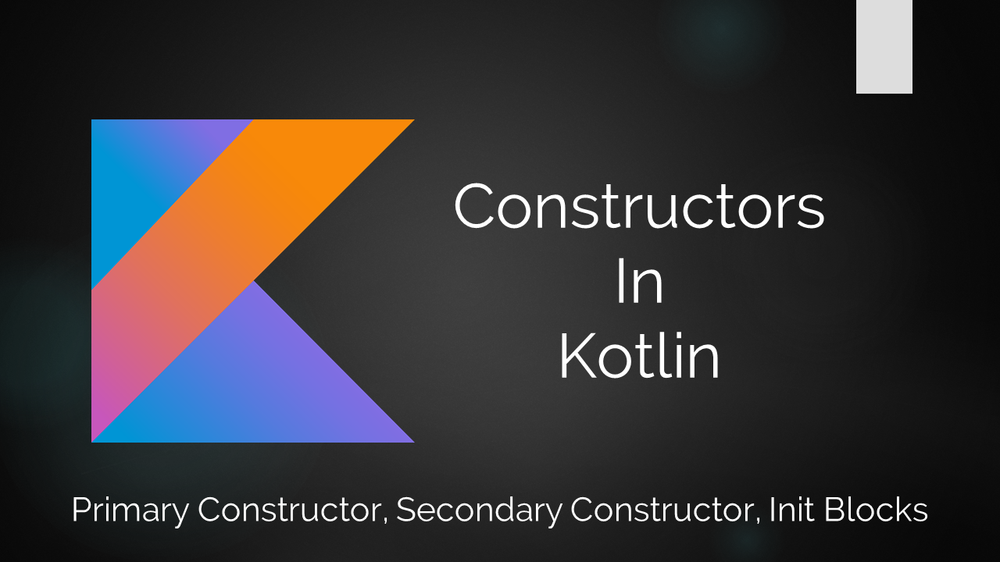
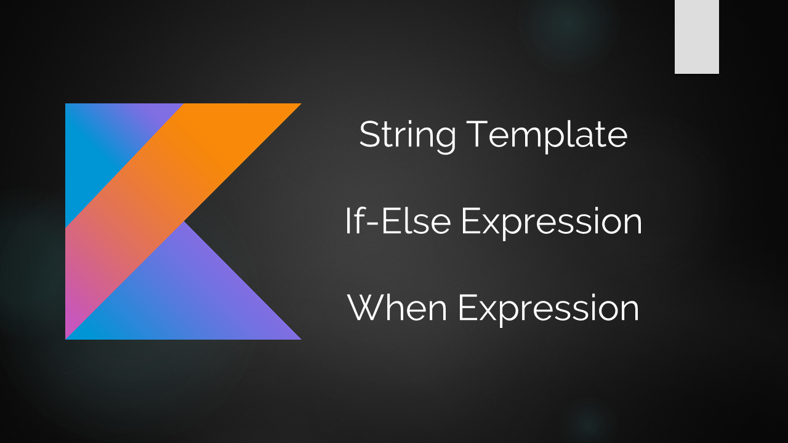

# KotlinMania

This repo is a collection of my tutorials on Kotlin. I have created article + video + code combination to explain Kotlin concepts. Following is a list of such tutorials (list may not be up-to-date, check repo code for details):

1. 
(<b>Constructors in Kotlin: Primary Constructor, Secondary Constructor, Init Blocks</b>)

<a href="http://www.downloadinformer.com/constructors-in-kotlin-explained-with-example/">Article Link</a>

<a href="https://www.youtube.com/watch?v=-1Rfj9is0vg">Video Tutorial</a>

2. 
(<b>String Template, If-Else and When Expressions in Kotlin</b>)
<a href="http://www.downloadinformer.com/string-template-if-else-and-when-expressions-in-kotlin/">Article Link</a>

<a href="https://www.youtube.com/watch?v=m6ir74AJo2c">Video Tutorial</a>

Appropriate code samples of above tutorials are in repo!

## Contribute

If you want a tutorial on a specific concept of Kotlin, you can raise an issue here and I will cover that topic for you.

If you want to contribute on a topic of your interest, feel free to create a PR :)
